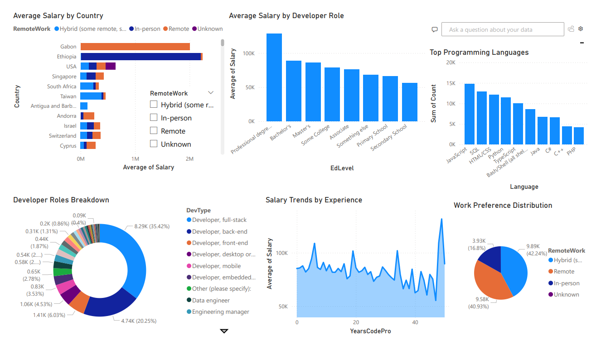

# 📊 Job Market Analysis Dashboard – Power BI

An interactive dashboard project analyzing global developer salary, experience, roles, education, and technology trends based on Stack Overflow's 2023 Developer Survey.

## 🧾 Dataset
Cleaned and processed version of Stack Overflow's developer survey.

## 🎯 Features
- Average salary by country and education level
- Role distribution across developers
- Work preference breakdown (Remote vs On-Site)
- Top programming languages used
- Salary trend by experience

## 🛠️ Tools & Skills
- Power BI (Data modeling, DAX, visualization)
- Python (Data cleaning)
- CSV, Visual storytelling

## 📸 Preview

## 📂 Files Included
- `job_market_dashboard.pbix` – Main Power BI file
- `cleaned_survey_data.csv` – Final dataset
- `top_languages.csv` – Extracted language data
- `README.md` – Project summary

## 📌 Author
Adarsh Pujari

